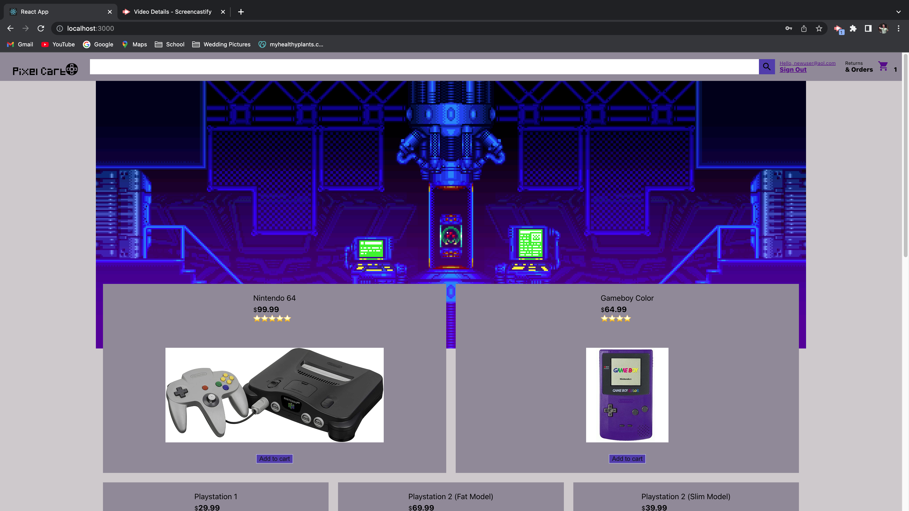

  # Pixel-Cart
## This is an online store specializing in video games and video game accessories
  
## Badge: []

Author:  XxElijahMxX MWright98 MrPerry365

## Table of Contents:
- [username](#username),
- [profile](#profile),
- [installation](#installation),
- [usage](#usage),
- [license](#license),
- [contributors](#contributors),
- [test](#test),
- [author](#author),
- [questions](#questions),

## Screenshot

## Installation
clone the repository and use [npm i] to install the dependencies

## Usage
As the owner of the site and or products you can make money. As a customer you can spend money to obtain the goods

## Contributors
XxElijahMxX MWright98 MrPerry365

## License
### MIT
### link: (https://opensource.org/licenses/MIT)

## Questions
### If you have any questions, contact me at:

#### GitHub Username: [XxElijahMxX MWright98 MrPerry365]

#### GitHub Profile: [https://github.com/XxElijahMxX/Pixel-Cart.git]

